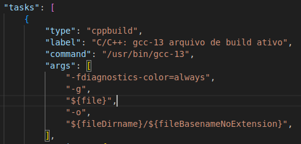
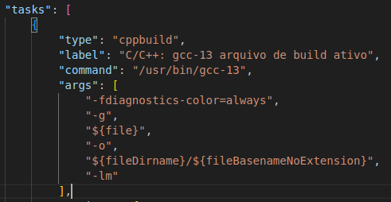

Ao tentar rodar os exercícios, boa parte deles estavam retornando um erro,visto que
o arquivo executável não estava sendo gerado (mencionei com você na aula).

O problema foi solucionado, alterando o arquivo tasks.json, simplesmente adicionando,
no vetor de 'args' do build do binário, o "-lm", que veio faltando.

O tasks.json deste projeto está alterado, e não reflete o tasks.json que é criado por padrão (e o da imagem 'antes').
Realizei uma pequena alteração para que o binário seja um arquivo temporário, e não persista na memória.

O 'projeto' está configurado de maneira que você não precise lançar 'gcc exercicio_x' toda hora, seu debugger gcc deve
funcionar normalmente.

Eu mid virto.